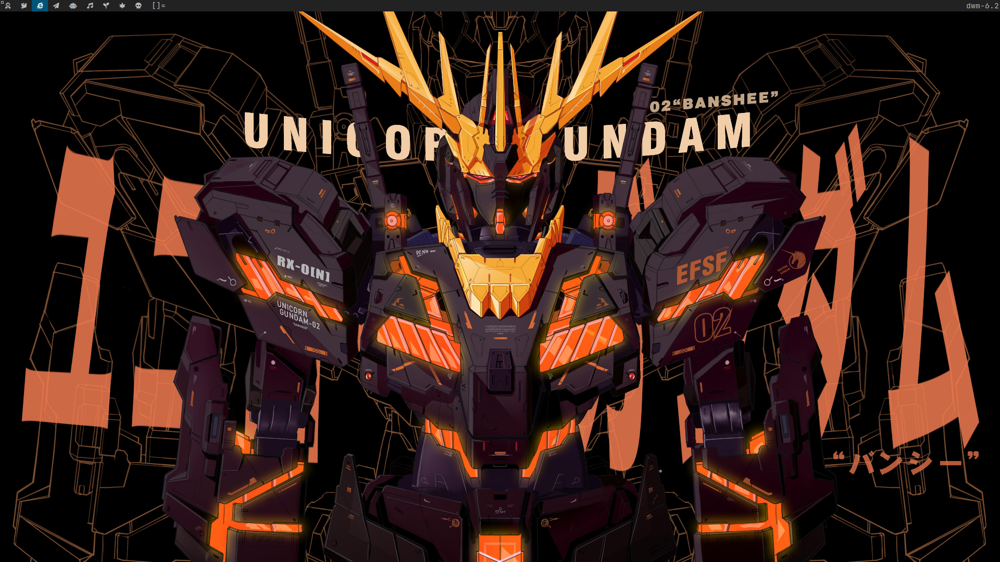
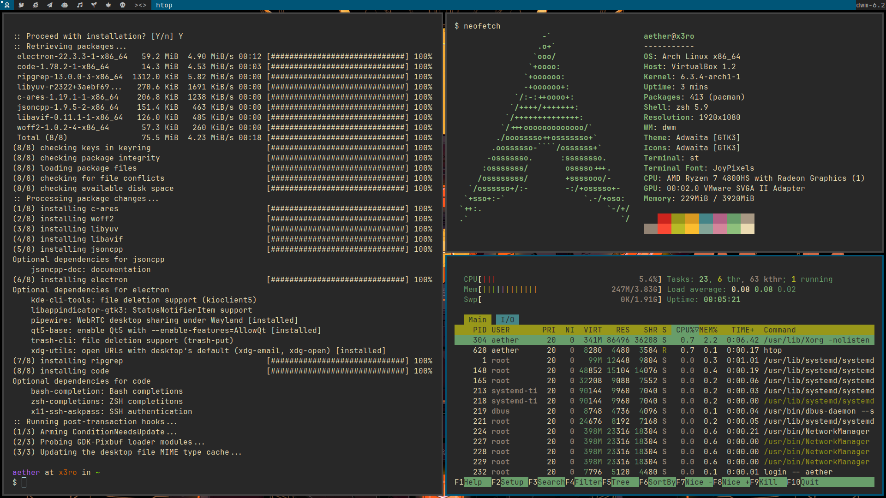

# dotfiles
dotfiles for my different machines

## Arch rice

### X11 dotfiles

-   WM: [dwm](https://dwm.suckless.org/)
-   Menu: [dmenu](https://git.suckless.org/dmenu/)
-   Terminal: [st](https://st.suckless.org/)
-   Editor: [NeoVim](https://github.com/neovim/neovim)
-   Shell: [zsh](https://www.zsh.org/)

## Windows

### WSL

-   Distro: [arch](https://archlinux.org/)
-   Shell: [zsh](https://www.zsh.org/)
-   Editor: [NeoVim](https://github.com/neovim/neovim)
-   Prompt: [Oh-my-zsh]([https://ohmyposh.dev/docs/installation/windows](https://ohmyz.sh/))
-   Directory Jumper: [ranger](https://github.com/ranger/ranger)

### PowerShell

- Shell: [PowerShell](https://github.com/PowerShell/PowerShell)
- Prompt: [Oh-my-posh](https://ohmyposh.dev/docs/installation/windows)
- Font : [Nerd-Fonts](https://www.nerdfonts.com/)
- Editor: [NeoVim](https://github.com/neovim/neovim)
- Theme : [Bright Lights](https://windowsterminalthemes.dev/?theme=Bright%20Lights)

I'll add links to everything and a script to automate this soon.  :)
