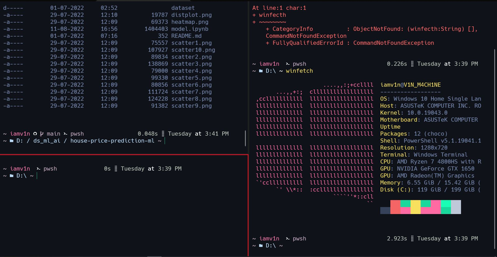

# dotfiles
dotfiles for my different machines

## arch

### X11 dotfiles

-   WM: [dwm](https://dwm.suckless.org/)
-   Menu: [dmenu](https://git.suckless.org/dmenu/)
-   Terminal: [st](https://st.suckless.org/)
-   Editor: [NeoVim](https://github.com/neovim/neovim)

## windows

Uses:
- oh-my-posh
- Nerd-Fonts
- Dracula color Scheme

I'll add links to everything and a script to automate this soon.  :)
